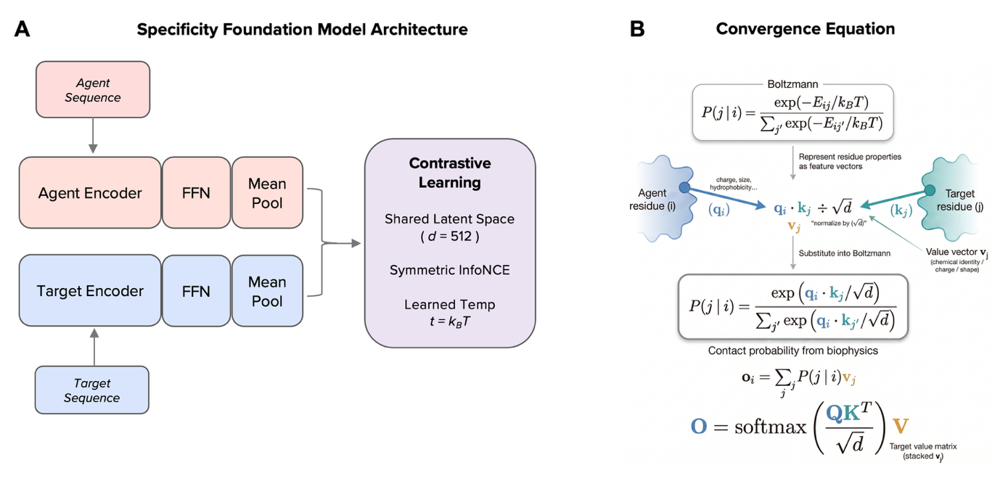

# Vibe Coding Specificity Foundation Models

**Sai T. Reddy** · Department of Biosystems Science and Engineering, ETH Zurich · Botnar Institute of Immune Engineering (BIIE), Basel

[](https://doi.org/10.64898/2026.06.04.730134)
[](https://doi.org/10.64898/2026.06.04.730134)
[](LICENSE.md)
[](https://huggingface.co/SFM-BIIE-ETHZ)

---



*Figure 1 | SFM architecture and the convergence equation. (A) Two frozen pretrained encoders map agent and target sequences to a shared 512-dimensional latent space via trainable FFN projection heads. Training minimises the symmetric InfoNCE loss with learned temperature τ. (B) The convergence equation: transformer softmax attention is mathematically identical to the Boltzmann distribution governing molecular binding.*

---

## Overview

Molecular recognition — the determination of which agent binds which target — governs adaptive immunity, gene regulation, signal transduction, RNA silencing, enzyme catalysis, and the selectivity of therapeutics. Determining binding specificity remains dependent on experimental screening or domain-specific computational tools that do not generalise across binding modalities.

**A Specificity Foundation Model (SFM)** is a physics-derived, sequence-native architecture that maps any agent–target sequence pair to a binding compatibility score, enabling bidirectional retrieval across molecular recognition domains without requiring structural information.

This repository contains code, evaluation pipelines, audit records, and supplementary data for **six SFMs** — each the first of its kind for its domain — trained using the **identical architecture without modification**:

| SFM | Domain | Agent | Target | In-dist R@1 (pool-512) |
|-----|--------|-------|--------|------------------------|
| tSFM | Transcription factor–DNA | TF protein | DNA binding site | 83.1 ± 3.0% |
| eSFM | Enzyme–substrate | Enzyme | Substrate (SMILES) | 86.3 ± 1.5% |
| mhcSFM | Peptide–MHC class I | Peptide | HLA allele | 65.1 ± 1.9% |
| crisprSFM | CRISPR gRNA–off-target DNA | gRNA | Genomic site | 95.4 ± 6.5% |
| mir-SFM | microRNA–mRNA target | miRNA | mRNA 3′-UTR | 98.0 ± 0.6% |
| dtSFM | Drug–target protein | Drug (SMILES) | Protein | 27.7 ± 3.3% |

Random baseline at pool size 512: **0.2%**.

---

## The Convergence Equation

The central theoretical result motivating the SFM architecture is that **transformer softmax attention is mathematically identical to the Boltzmann distribution** governing molecular binding at thermal equilibrium:

$$\underbrace{\text{softmax}\left(\frac{QK^\top}{\sqrt{d}}\right)}_{\text{transformer attention}} = \underbrace{\frac{\exp(-E_{ij}/k_BT)}{\sum_j \exp(-E_{ij}/k_BT)}}_{\text{Boltzmann distribution (biophysics)}}$$

This identity, together with five conditions of molecular recognition systems, prescribes a **single neural network architecture** for cross-modal binding prediction:

1. Dual frozen sequence encoders (one per modality)
2. Trainable FFN projection heads mapping to a shared 512-d latent space
3. Cosine similarity as the compatibility score
4. Symmetric InfoNCE contrastive loss
5. Learned physical temperature τ = k_BT

$$\mathcal{L} = -\frac{1}{2N}\sum_{i=1}^{N}\left[\log\frac{e^{s_{ii}/\tau}}{\sum_j e^{s_{ij}/\tau}} + \log\frac{e^{s_{ii}/\tau}}{\sum_j e^{s_{ji}/\tau}}\right]$$

Because the architecture is fully prescribed by the physics, what remains for the domain expert is **scientific judgment** — which encoders, which data — not ML engineering.

---

## Architecture

All six SFMs share the identical architecture (5–7 M trainable parameters, ~1 hr training on a single GPU):

```
Agent sequence  ──► Encoder_A ──► FFN ──►  z_A  ─┐
                                                   ├──► symmetric InfoNCE  ──►  compatibility score
Target sequence ──► Encoder_T ──► FFN ──►  z_T  ─┘
                                    (shared 512-d latent space)
```

Encoder pairs (pretrained backbone frozen; only FFN projection heads are trained):

| SFM | Agent encoder | Target encoder |
|-----|--------------|----------------|
| tSFM | ESM-2 (protein) | DNABERT-2 (DNA) |
| eSFM | ESM-2 (protein) | MoLFormer-XL (SMILES) |
| mhcSFM | ESM-2 (peptide) | ESM-2 (34-aa pseudo-sequence) |
| crisprSFM | DNABERT-2 (gRNA) | DNABERT-2 (genomic DNA) |
| mir-SFM | DNABERT-2 (miRNA) | DNABERT-2 (3′-UTR) |
| dtSFM | MoLFormer-XL (SMILES) | ESM-2 (protein) |

---

## Model Weights

Pre-trained checkpoints for all six SFMs are publicly available on Hugging Face:

| SFM | Hugging Face repo |
|-----|------------------|
| tSFM | [`SFM-BIIE-ETHZ/tSFM_VC-SFM`](https://huggingface.co/SFM-BIIE-ETHZ/tSFM_VC-SFM) |
| eSFM | [`SFM-BIIE-ETHZ/eSFM_VC-SFM`](https://huggingface.co/SFM-BIIE-ETHZ/eSFM_VC-SFM) |
| mhcSFM | [`SFM-BIIE-ETHZ/mhcSFM_VC-SFM`](https://huggingface.co/SFM-BIIE-ETHZ/mhcSFM_VC-SFM) |
| crisprSFM | [`SFM-BIIE-ETHZ/crisprSFM_VC-SFM`](https://huggingface.co/SFM-BIIE-ETHZ/crisprSFM_VC-SFM) |
| mir-SFM | [`SFM-BIIE-ETHZ/mirSFM_VC-SFM`](https://huggingface.co/SFM-BIIE-ETHZ/mirSFM_VC-SFM) |
| dtSFM | [`SFM-BIIE-ETHZ/dtSFM_VC-SFM`](https://huggingface.co/SFM-BIIE-ETHZ/dtSFM_VC-SFM) |

---

## Quick Start

```bash
# 1. Clone
git clone https://github.com/Reddy-BIIE-ETHZ/Vibe-Coding-SFMs.git
cd Vibe-Coding-SFMs

# 2. Install
conda env create -f environment.yml
conda activate calm
```

```python
from huggingface_hub import hf_hub_download
import torch, torch.nn.functional as F
from calm.encoder.model import CALMEncoder

# Download any VC-SFM checkpoint — one line
ckpt = hf_hub_download("SFM-BIIE-ETHZ/mirSFM_VC-SFM", "model.pth")
model = CALMEncoder.from_pretrained(ckpt)
model.eval()

# Bidirectional scoring
mirna_emb = model.encode_query("UAGCUUAUCAGACUGAUGUUGA")
mrna_emb  = model.encode_target("GCAUGUUUUCAAAGAUGAGAGGACGCAUAUAAUUU")
score = F.cosine_similarity(mirna_emb, mrna_emb, dim=-1)
# score ∈ [-1, 1]; higher = stronger predicted binding
```

The same `encode_query` / `encode_target` / cosine similarity pattern works for all six SFMs.

---

## Repository Structure

```
Vibe-Coding-SFMs/
├── src/calm/              # Shared architecture (encoders, training, eval)
├── sfms/
│   ├── tSFM/              # TF–DNA: data prep, training, eval scripts
│   ├── eSFM/              # Enzyme–substrate
│   ├── mhcSFM/            # Peptide–MHC
│   ├── crisprSFM/         # CRISPR gRNA–off-target
│   ├── mir-SFM/           # microRNA–mRNA
│   └── dtSFM/             # Drug–target
├── evaluation/            # Pool-512 retrieval + leakage verification
├── figures/               # Figure 1–3 build scripts + data CSVs
├── supplementary/         # Supp Table S1 (per-fold retrieval results)
├── audit/                 # Orthogonal AI audit records (per-SFM)
└── docs/                  # Extended methods, DNABERT-2 GPU patch
```

---

## Data

Training data sources (all publicly available):

| SFM | Database | Pairs |
|-----|----------|-------|
| tSFM | JASPAR 2022 | 20,540 |
| eSFM | ReactZyme (Hua et al., NeurIPS 2024) | 177,442 |
| mhcSFM | NetMHCpan 4.1 (BA) | 168,710 |
| crisprSFM | CCLMoff | 30,342 |
| mir-SFM | ENCORI CLIP-seq | 206,692 |
| dtSFM | DAVIS + KIBA + BindingDB | 121,548 |

---

## Reproducibility

All six SFMs trained with identical hyperparameters:

| Setting | Value |
|---------|-------|
| Optimizer | AdamW |
| Learning rate | 1×10⁻³ |
| Scheduler | CosineAnnealingWarmRestarts (T₀=20) |
| Batch size | 64 |
| Epochs | 100 |
| Temperature | Learned (init 0.07) |

Cross-validation: 5-fold stratified by clustering threshold (MMseqs2 for protein/SMILES; Hamming for nucleotide sequences).

---

## Vibe Coding and Orthogonal Verification

**Vibe coding — [Claude Code](https://claude.ai/code) (Anthropic):** All six SFMs were built by a domain expert (S.T.R.) with biological and ML conceptual knowledge but **no Python programming experience**. [Claude Code](https://claude.ai/code) (Anthropic) served as the AI coding assistant throughout — natural-language prompts directed all data preprocessing, training-script construction, SLURM job management, and evaluation pipelines.

**Orthogonal AI verification — Codex (OpenAI):** Every numerical claim in the paper was independently verified by a second, separate AI agent — Codex (OpenAI) — operating exclusively on artifacts committed to this repository prior to audit initiation. The auditing agent had no access to the vibe coding sessions and received no guidance from the developer. Audit records are in [`audit/`](audit/).

---

## Citation

```bibtex
@article{reddy2026vcsfm,
  title   = {Vibe Coding Specificity Foundation Models},
  author  = {Reddy, Sai T.},
  journal = {bioRxiv},
  year    = {2026},
  doi     = {10.64898/2026.06.04.730134}
}
```

---

## License

Released under the **SFM Research Preview License v1.0-preview** (see [LICENSE.md](LICENSE.md)).
Free for research use (academic, non-profit, government, and industry research). The specific
molecules disclosed in the accompanying preprints are dedicated to the public (§3). Commercial-use
and patent-licensing terms are deferred and being arranged with ETH Zürich / BIIE; the SFM
architectures and training methods are the subject of pending patent applications.
For commercial enquiries: sai.reddy@ethz.ch
